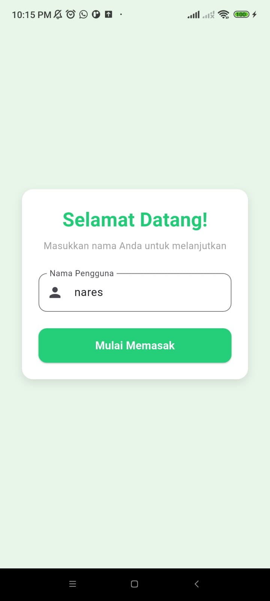
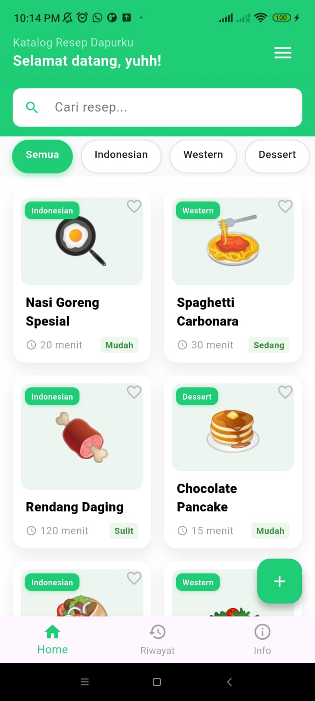
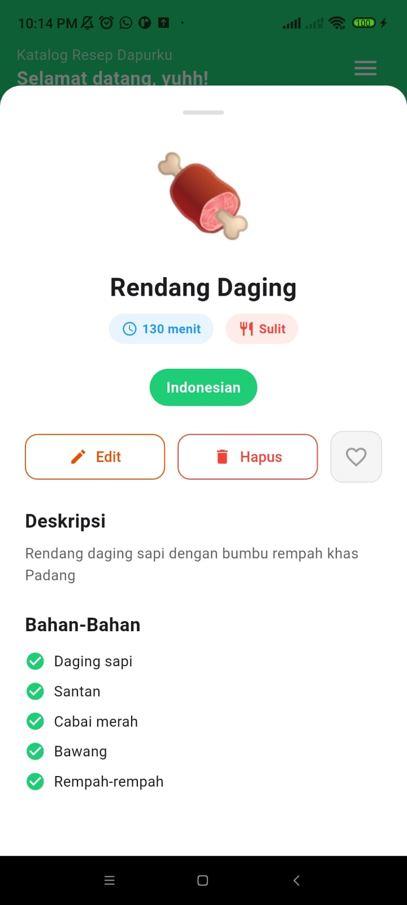
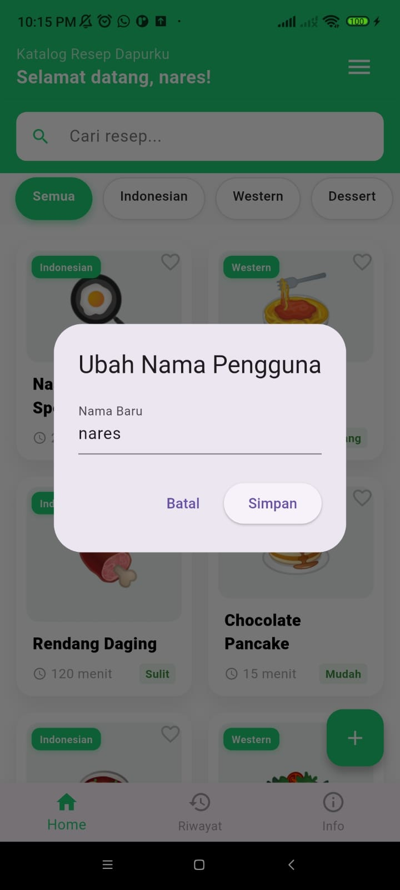
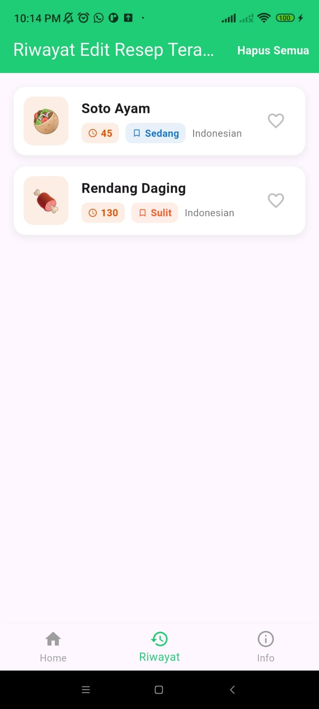
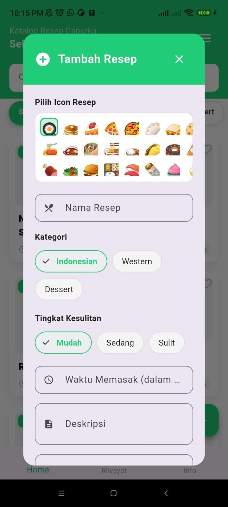
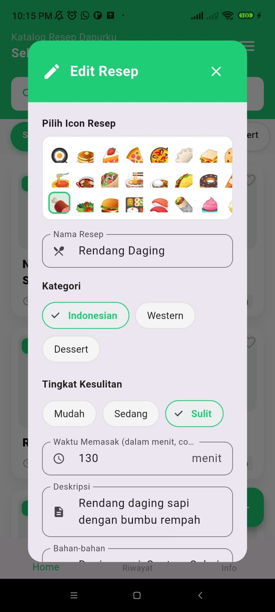
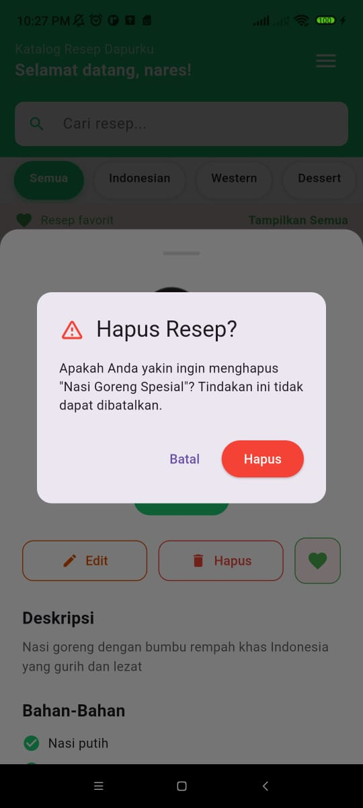

# 🥘Aplikasi Resep Dapurku

Aplikasi katalog resep dapurku sederhana menggunakan Flutter dengan fitur:
- Login aplikasi
- Tambah resep
- Lihat detail resep
- Filter kategori
- Riwayat edit resep
- Info Aplikasi
- Ubah nama user
- UI clean & modern

*Projek ini dibuat untuk memenuhi tugas UTS pada mata kuliah Pemrograman Mobile 2

Dibuat Oleh :
Alvina Nindita Nareswari

---

### Home

  
  
  
  
  
  
  
  
  
  
  

