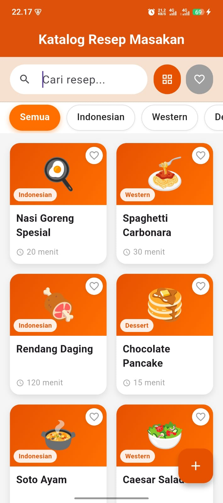
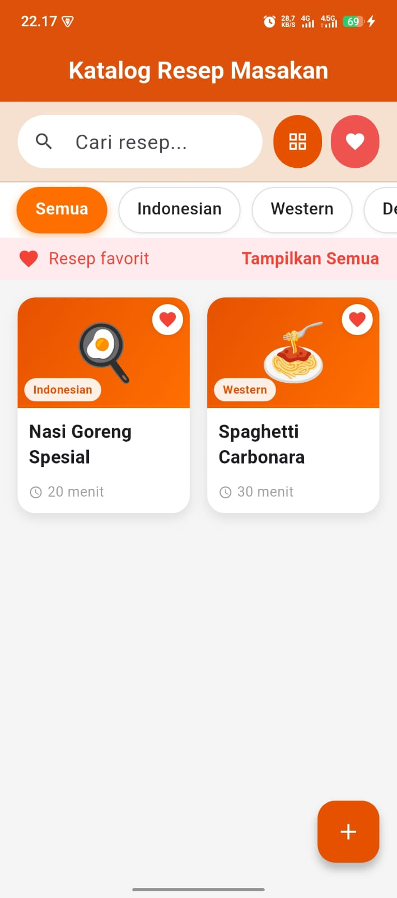
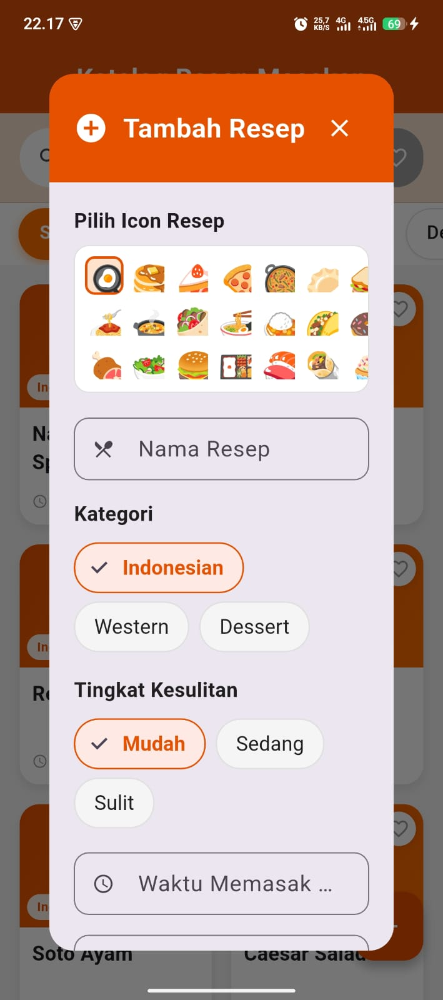
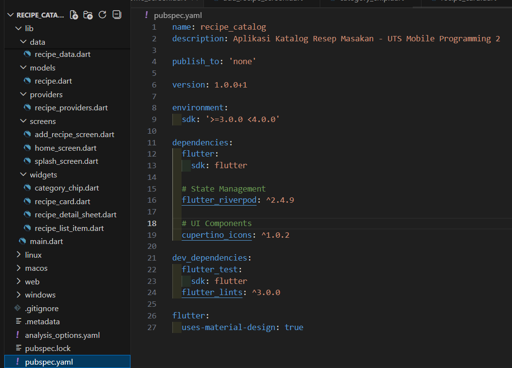

# 🍽️ Recipe Catalog App

Aplikasi katalog resep sederhana menggunakan Flutter + Riverpod dengan fitur:
- Tambah resep
- Lihat detail resep
- Filter kategori
- UI clean & modern

*Projek ini dibuat untuk memenuhi tugas UTS pada mata kuliah Pemrograman Mobile 2

Dibuat Oleh :
- Muhammad Fikri Muhaimin
- Sendi Resfiana
- Ghefira Zahira Shofa

---

### Home

  
  
  
  

---

## 📄 Laporan
📘 **[Klik untuk membuka laporan](docs/laporan_aplikasi_catalog_resep_makanan.pdf)**

## 🎥 Video Demo
▶️ **[Klik untuk menonton video demo](https://drive.google.com/drive/folders/1I8t8toDwCKalpEbC3eJF6IXL6qDeDh6c?usp=drive_link)**

---

